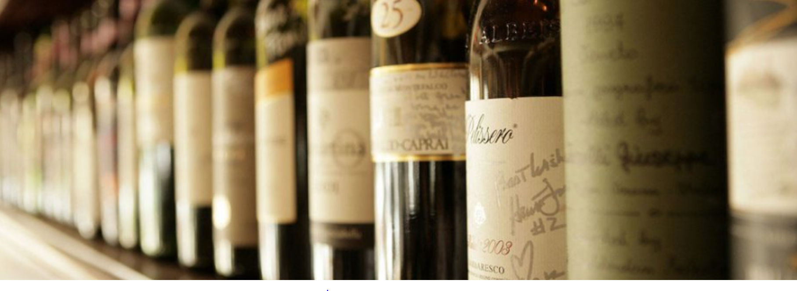
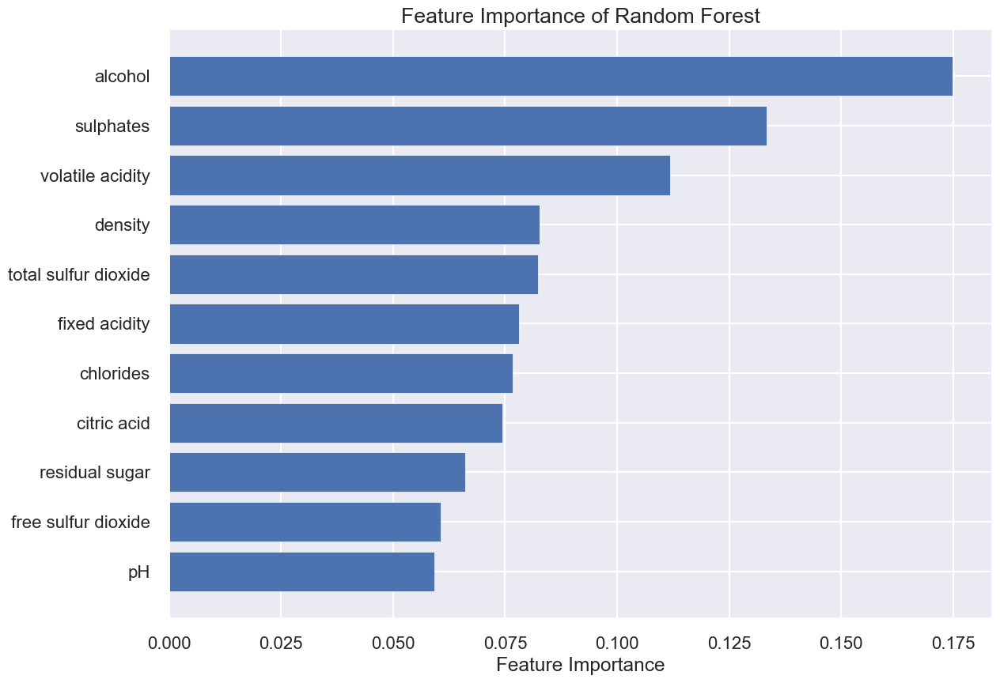

# Wine Quality Classification Prediction and Analysis

**Author**: [Ruthy Yao](mailto:zejia.yao@gmail.com)

## Overview

This project aims to help Riverwood Wine to accurately predict their red wine products that would be rated as "High-Quality" by the industry body. This would allow a more focused approach on sales and marketing capital allocation. The secondary goal was to understand the drivers of a "High-Quality" wine, so they can target the most important physio-chemical properties for measure and management during the production process. This will ultimately enhance the product quality of Riverwood's wine products.  

To solve the business problems, predicative analysis tested on three classification models was applied. Random Forest algorithm was chosen as the final model based on a well-rounded review on the test scores. The feature importance technique was employed to identify the five most important factors that make a "High-Quality" rating. The quartile analysis was used to identify the value range for each of the top five parameters so Riverwood can use it as a benchmark for quality control during the fermentation process.  

## Business Problem

Riverwood Wine is a renowed winemaker in the industry. Every year, they participate in the industry competition for quality award. Wining the award will greatly enhance their brand value and boost their sales. 

Historically, Riverwood Wine enlisted all their products to the industry competition. To increase their chances of win, they would invest significantly on all products, which is not only costly but also less efficient in using the capital. Moving foreward, Riverwood Wine plans to adopt a more "focused" approach in their sales and marketing spend - they will allocate the capital to only the "high-quality" wines that are most likely to win the industry award. The management team also want to find out the drivers of high-quality wines, so they can target the prarmeters to be measured and managed during the fermentation process. This will ultimately enhance the quality of their wine products. 

We will look to understand the probability of wines that would be rated as "high-quality" by the industry body and what the drivers are for this, so Riverwood Wine can target the physio-chemical properties that need to measured and managed to secure a "high-quality" rating.


## Data and Methods

The dataset comes from the red variants of the Portuguese "Vinho Verde" wine (see [Cortez et al., 2009], http://www3.dsi.uminho.pt/pcortez/wine/), which contains 1599 entries of red wine products. Te data features 11 physiochemical properties and the wine quality in ordinal numbers from 1 to 8. 

This project employs the descriptive and predictive analysis to identify the most contributing factors for a high-quality wine. Based on the 11 physiochemical parameters, it can predict whether a wine will achieve the "high-quality" status. This provides great insights on what makes a "high-quality" wine, the most determining physiochemical properties and the desirable range for each.  

Three machine learning models are trained and assessed based on the accuracy score and the F1 score (a combination of precision and recall). The Random Forest model triumphed over the other two algorithms - Logistic Regression and Decision Tree. The "feature importance" technique was employed to select the parameters that contributed the most to the "high-quality" status. For the top five most important factors, we use a quartile distribution analysis to decide the value range for each parameter. 

## Results and Insights

The final model using Random Forest algorithms achieve a prediction accuracy of 93.4% and a F1 score (a combination of precision and recall) of 71.2%.

The ranking of the 11 parameters based on their significance to the quality classification is as following.



For the top five parameters, the desirable value range based on where the most data lies are: 

* Alcohol - to control between 10.8 and 12.2;
* Sulphates - to control between 0.65 and 0.86;
* Volatile acidity - to control between 0.3 and 0.49;
* Density - to control between 0.9947 and 0.9974;
* Total sulfur dioxide - to control between 17 and 43.

### Nest Steps

Further analyses could yield additional insights to further improve the prediction at Riverwood Wine.
    
- **Enlarge the sample size** - This dataset has only 1599 entires of the wine product with only ~230 classified as "high-quality". Enlarge the sample size will improve the predicative accuracy.

- **Analyse the interacted features** - Some physicochemical properties are interdependent. Build interaction features will improve the predicative power. 

- **Prepare for the model deployment** - - Further analysis on what fermentation techniques and how to implement the techniques to control the physio-chemical properties in the desirable range will prepare us for the implementation of those analytical insights in the real world practice.  

## For More Information

See the full analysis in the [Jupyter Notebook](./wine_quality_analysis.ipynb) or review this [presentation](./wine_quality_analysis_presentation.pdf).

For additional info, contact Ruthy Yao at [zejia.yao@gmail.com](mailto:zejia.yao@gmail.com)

## Repository Structure

```
├── Data
│   └── winequality-red.csv
├── images
├── wine_quality_analysis.ipynb 
├── wine_quality_analysis_presentation.pdf
└── README.md
```
# House_valuation_tool
